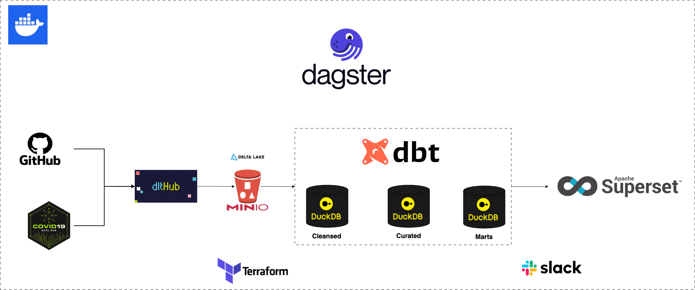
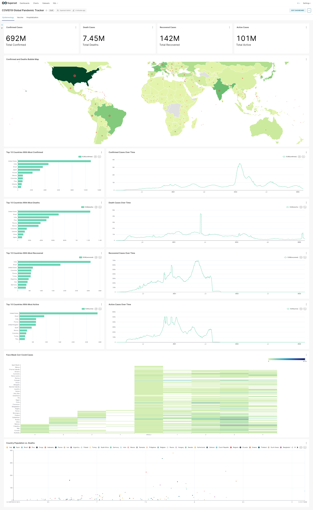

# COVID19 Global Pandemic Tracker Pipeline

<!-- TABLE OF CONTENTS -->
<details open="open">
  <summary>Table of Contents</summary>
  <ol>
    <li>
      <a href="#overview">Overview</a>
    </li>
    <li>
      <a href="#the-data">The Data</a>
    </li>
    <li>
      <a href="#the-opportunity">The Opportunity</a>
    </li>
    <li>
      <a href="#technology-architecture">Technology Architecture</a>
    </li>
    <li>
      <a href="#design-decisions">Design Decisions</a>
    </li>
    <li>
      <a href="#covid19-global-pandemic-dashboard">COVID19 Global Pandemic Dashboard</a>
    </li>
    <li>
      <a href="#setup-instructions">Setup Instructions</a>
    </li>
    <li>
      <a href="#access-to-web-user-interface">Access to Web User Interface</a>
    </li>
    <li>
      <a href="#project-structure">Project Structure</a>
    </li>
    <li>
      <a href="#maintainability-commands">Maintainability Commands</a>
    </li>
  </ol>
</details>


## Overview

This project aims to consolidate COVID19 Data from heterogeneous data source through a data pipeline. This will enable the analysis of the famous COVID19 pandemic to extract meaningful insights.
The pipeline is designed with robustness, scalability, and modularity in mind—showcasing practical data engineering techniques in a modern data stack.

---

## The Data
The main data that we are going to use is the COVID19 Data from the [COVID-19 Data Repository by the Center for Systems Science and Engineering (CSSE) at Johns Hopkins University](https://github.com/CSSEGISandData/COVID-19/).
The dataset contains daily cumulative reports of confirmed, death, recovered, and active cases from different administrative area levels globally.

Additionally, we will also utilize the data from [covid19datahub.io](https://covid19datahub.io/) to enrich our analysis and be able to find interesting correlations and patterns from different variables
such as government policy measures, hospitalization, vaccination, and covid testing data.

---

## The Opportunity
Below, we will define the focus area of our analysis to centralize the scope our project.
1. What are the top 10 countries with most confirmed or death cases?
2. What are the top 10 countries with least confirmed or death cases?
3. How many daily deaths on average per country?
4. Which countries has the lowest death to confirmed cases ratio
5. How does the deaths, active, and confirmed cases change over time?
6. Top 10 Countries with most daily tests and hospitalizations?
7. What are the most fully vaccinated countries with respect to their population?
8. What are the effects of government policies to COVID19 deaths / recovered / confirmed cases?
9. Is there a positive effect on the likelihood of getting infected for those countries who have stricter policy measures?

---
## Technology Architecture


---
## Design Decisions
**General:** In general, I followed the KISS principle to make the design simple and to promote longevity in terms of project maintenance. Another principle I followed was
idempotency for better predictability and less introduction of bugs to the pipeline. Finally, graceful handling of errors... in the data ingestion layer, changes into the upstream
data sources were handled gracefully by implementing ELT (schema on read) alongside schema registry/versioning –thanks to DLT and DeltaLake. In the transformation layer,
data contracts were enforced in the form of DBT tests to ensure data integrity, data accuracy, and data correctness. For any data pipeline errors, alerts were handled through slack notifications.

<table border="1" cellpadding="8" cellspacing="0">
  <thead>
    <tr>
      <th>Tech</th>
      <th>Purpose</th>
      <th>Rationale</th>
    </tr>
  </thead>
  <tbody>
    <tr>
      <td>Dagster</td>
      <td>Orchestration framework</td>
      <td>Was chosen over Airflow/Mage due to its modular and typed nature -- that gives a better local development UX, open-source integration with Modern Data Stack, strong pipeline monitoring and metadata handling, supports Dagster Cloud for production scalability.</td>
    </tr>
    <tr>
      <td>DBT for transformation</td>
      <td>SQL-based transformation wrapper</td>
      <td>Supports version control, documentation, model dependency graphs, easy database object handling, integrates with Dagster and CI/CD for testing and reliability.</td>
    </tr>
    <tr>
      <td>DuckDB</td>
      <td>Data Processing / Storage</td>
      <td>In-memory SQL engine (the T in ELT). Lightweight, fast setup, supports DeltaLake integration, easily swappable with MotherDuck for scalability.</td>
    </tr>
    <tr>
      <td>MinIO for Datalake</td>
      <td>Object storage</td>
      <td>Open-source, S3-compatible, Docker-compatible for seamless local and production environment use. (the storage for L in ELT)</td>
    </tr>
    <tr>
      <td>DLT</td>
      <td>Data ingestion </td>
      <td>Python-based tool supporting various sources/destinations with good metadata tracking for ingestion jobs. (the E in ELT)</td>
    </tr>
    <tr>
      <td>Delta File Format</td>
      <td>Columnar data storage</td>
      <td>Used with DLT for storing in S3 using Parquet, supports schema evolution and analytics use cases well.</td>
    </tr>
    <tr>
      <td>Docker Compose</td>
      <td>Containerization</td>
      <td>Development/Production Environment Consistency. Promotes reproducibility and consistent behavior across environments.</td>
    </tr>
    <tr>
      <td>Apache Superset</td>
      <td>Business Intelligence Visualization Tool</td>
      <td>Modern data stack compatible, supports dimensional models, self-service analytics, drag-and-drop interface, access control for governance.</td>
    </tr>
    <tr>
      <td>Star Schema</td>
      <td>Analytics Data Model</td>
      <td>Balances storage, usability, and performance; denormalized structure reduces joins, ideal for read-heavy workloads.</td>
    </tr>
    <tr>
      <td>Medallion Architecture</td>
      <td>Data quality layering</td>
      <td>Defines raw, cleansed, and curated layers; improves maintainability via separation of concerns.</td>
    </tr>
  </tbody>
</table>


---
## COVID19 Global Pandemic Dashboard


---
## Setup Instructions

### 1. Clone The Repository
```bash
git  https://github.com/1byte-yoda/covid19_data_pipeline.git
cd covid19_data_pipeline
```
### 2. Download The Required Software
Visit the following link and follow the instructions for software installation
- [Python 3.11+](https://www.python.org/downloads/)
- [Docker & Docker Compose Desktop](https://docs.docker.com/compose/install/)

### 3. Initialize The Infrastructure Needed For The Project
The command below will create a `.env` file of off the `.env.example` file which contains the project config and credentials.
Then, a MinIO S3 Bucket and its name will be appended to .env file 
```bash
make init_infra
```

### 4. Start the Docker Containers
```bash
make up
```

### 5. Download Initial Dagster Assets
The dagster data pipeline was designed to run based on a date range partition. And back filling the data from 2020-01-22 up to 2023-03-09 is very time consuming
given the limited compute that we have. To make it easier, we will pre-download and pre-compute the data from 2020-01-22 to 2023-02-28, and we can still play around the remaining data.
The command below will download the COVID19 data from an S3 bucket and dump it into our MinIO bucket. And then it will also run a full refresh on our dbt models.
```bash
make initial_assets
```

## Access to Web User Interface
- **Dagster** http://localhost:3000
- **Minio** http://localhost:9051
  - ```
    username: admin
    password: minioadmin
    ```
- **Superset** http://localhost:8088
  - ```
    username: admin
    password: admin
    ```

---

## Project Structure
```text
.
├── dags/                  # Dagster pipelines
├── dagster_home/          # Volume mount for dagster pipeline's dagster.yml config
├── data/                  # Volume mount for S3 datalake and DuckDB storage
├── docker/                # Contains the Dockerfiles and init scripts for the docker containers used in the docker-compose.yaml
├── img/                   # The image files used for README
├── infra/                 # Contains Infrastructure As Code / Terraform Scripts to create S3 buckets
├── transformer/           # Has the DBT scripts for the data models in cleansed, curated, and data mart layers.
├── .env.example           # The example .env file template that can be used by the docker containers
├── .gitignore             # Git Ignored files / folder
├── .sqlfluff              # Configuration for SQL Fluff Formatter / Linter
├── .sqlfluffignore        # Contains the list of files / folders to be ignored during the SQL lint / formatting process 
├── docker-compose.yml     # Docker Modern Data Stack setup
├── Makefile               # Has helpful commands and shortcuts for development productivity
├── pytest.ini             # The configuration file for pytest execution preferences / settings
└── README.md              # This file
├── requirements.txt       # Python Packages used by this project
├── requirements-dev.txt   # Separate Python Packages used in addition to requirements.txt, solely for development purposes
├── tox.ini                # Flake8 configuration for linting preferences
```
  
---
## Maintainability Commands
### 1. Install Python Modules Locally for Development / IDE Lints
```bash
python3 -m venv .venv
source .venv/bin/activate
pip3 install uv
uv pip install -r requirements.txt
uv pip install -r requirements-dev.txt
```
### 2. Running DBT Tests
```bash
make dbt_test
```
### 3. Running Python Unit Tests
```bash
make pytest
```
### 4. Format DBT/SQL Scripts
```bash
make dbt_fmt
```
### 5. Format Python Scripts
```bash
make black
```
### 6. Lint Python Scripts For Errors
```bash
make flake8
```

[//]: # (## Data Ingestion)

[//]: # ()
[//]: # (## Data Processing)

[//]: # ()
[//]: # (## Testing & Validation)
