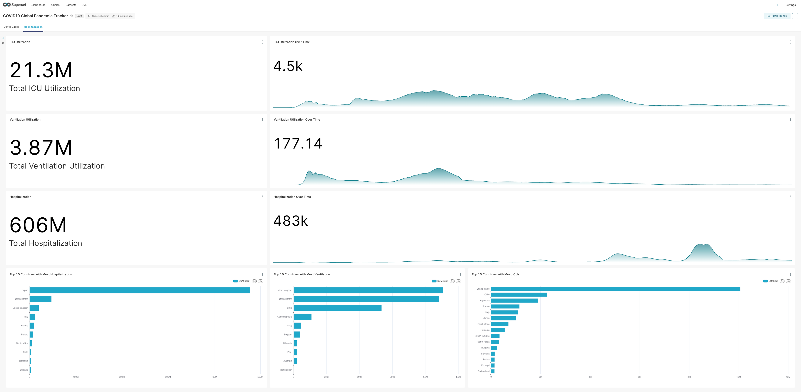

# COVID19 Global Pandemic Tracker Pipeline

<!-- TABLE OF CONTENTS -->
<details open="open">
  <summary>Table of Contents</summary>
  <ol>
    <li>
      <a href="#overview">Overview</a>
    </li>
    <li>
      <a href="#the-data">The Data</a>
    </li>
    <li>
      <a href="#the-opportunity">The Opportunity</a>
    </li>
    <li>
      <a href="#technology-architecture">Technology Architecture</a>
    </li>
    <li>
      <a href="#design-decisions">Design Decisions</a>
    </li>
    <li>
      <a href="#dimensional-data-model">Dimensional Data Model</a>
    </li>
    <li>
      <a href="#covid19-global-pandemic-dashboard-samples">COVID19 Global Pandemic Dashboard</a>
    </li>
    <li>
      <a href="#covid19-correlation-analysis-notebook">COVID19 Correlation Analysis Notebook</a>
    </li>
    <li>
      <a href="#setup-instructions">Setup Instructions</a>
    </li>
    <li>
      <a href="#access-to-web-user-interface">Access to Web User Interface</a>
    </li>
    <li>
      <a href="#project-structure">Project Structure</a>
    </li>
    <li>
      <a href="#maintainability-commands">Maintainability Commands</a>
    </li>
  </ol>
</details>


## Overview

This project aims to bring together COVID-19 data from various sources through a well-organized data pipeline. Our goal is to help better understand the COVID-19 pandemic by making it easier to analyze data and extract valuable insights.

The pipeline is built to be reliable, scalable, and easy to maintain, demonstrating practical data engineering methods using modern tools. Through this, we hope to make information clearer and more accessible—helping communities better understand the challenges brought by COVID-19.

---

## The Data
Our primary dataset will come from the [COVID-19 Data Repository by Johns Hopkins University's Center for Systems Science and Engineering (CSSE)](https://github.com/CSSEGISandData/COVID-19/). This dataset includes daily updates on confirmed cases, deaths, recoveries, and active cases from various locations around the world.

To further deepen our understanding, we'll also use supplementary data from [covid19datahub.io](https://covid19datahub.io/). This additional information will allow us to explore valuable insights and identify meaningful patterns related to government policies, hospitalizations, vaccination efforts, and COVID-19 testing trends.

By combining these sources, we hope to gain a richer picture of how different factors have influenced the pandemic and how communities have responded over time.

---

## The Opportunity
Below, we will define the focus area of our analysis to centralize the scope our project.
1. What are the top 10 countries with most confirmed or death cases?
2. What are the top 10 countries with least confirmed or death cases?
3. How many daily deaths on average per country?
4. Which countries has the lowest death to confirmed cases ratio
5. How does the deaths, active, and confirmed cases change over time?
6. Top 10 Countries with most daily tests and hospitalizations?
7. What are the most fully vaccinated countries with respect to their population?
8. What are the effects of government policies to COVID19 deaths / recovered / confirmed cases?
9. Is there a positive effect on the likelihood of getting infected for those countries who have stricter policy measures?

These questions have been answered by creating **SQL queries** on top of the dimensional models. And it is visualized / presented through **Apache Superset Dashboard** as well as a
**Jupyter Notebook**

---
## Technology Architecture


---
## Design Decisions
In general, I followed the KISS principle to make the design simple and to promote longevity in terms of project maintenance. Another principle I followed was
idempotency for better predictability and less introduction of bugs to the pipeline. Finally, graceful handling of errors... in the data ingestion layer, changes into the upstream
data sources were handled gracefully by implementing ELT (schema on read) alongside schema registry/versioning –thanks to DLT and DeltaLake. In the transformation layer,
data contracts were enforced in the form of DBT tests to ensure data integrity, data accuracy, and data correctness. For any data pipeline errors, alerts were handled through slack notifications.

<table border="1" cellpadding="8" cellspacing="0">
   <thead>
      <tr>
         <th>Tech</th>
         <th>Purpose</th>
         <th>Rationale</th>
      </tr>
   </thead>
   <tbody>
      <tr>
         <td>Dagster</td>
         <td>Data Orchestration</td>
         <td>I chose Dagster over Airflow/Mage because it’s a modular, Python-based framework that’s easy to work with, especially for local development. It also integrates well with modern data stacks, making it easier to manage and monitor pipelines. The built-in cloud deployment option ensures scalability for production workloads, and I appreciate its features for tracking data lineage and observability.</td>
      </tr>
      <tr>
         <td>DBT for transformation</td>
         <td>SQL Transformation</td>
         <td>DBT is the perfect tool for SQL-based data transformations. It supports version control, documentation, and automated testing, which is crucial for data quality. It also integrates smoothly with Dagster, allowing me to manage workflows and transformations in a seamless manner.</td>
      </tr>
      <tr>
         <td>DuckDB</td>
         <td>Data Processing/Storage</td>
         <td>I chose DuckDB because it’s lightweight and fast, thanks to its in-memory processing. It’s an efficient database that supports DeltaLake integration, and it can easily be swapped for MotherDuck when we need to scale in production.</td>
      </tr>
      <tr>
         <td>MinIO for Datalake</td>
         <td>Object Storage</td>
         <td>I use MinIO because it’s an open-source datalake that’s compatible with AWS S3, which gives me the flexibility to switch between S3 and MinIO when needed. It's also Docker-compatible, which makes it portable for both development and production environments.</td>
      </tr>
      <tr>
         <td>DLT</td>
         <td>Data Ingestion</td>
         <td>DLT is a Python-based tool for data ingestion that integrates well with Dagster. It supports various sources and destinations, such as DuckDB and S3, and provides excellent metadata management, making it easy to track ingestion loads and schema evolution.</td>
      </tr>
      <tr>
         <td>Delta File Format</td>
         <td>Columnar Data Storage</td>
         <td>I use DeltaLake for data storage because it’s optimized for analytics and works well with DLT. It uses Parquet behind the scenes for columnar storage, which is perfect for our analytics use case. DeltaLake also supports schema evolution, making it more resilient to changes in upstream schemas.</td>
      </tr>
      <tr>
         <td>Docker Compose</td>
         <td>Containerization</td>
         <td>I prefer Docker Compose for maintaining consistent environments from development to production. It ensures that my applications behave the same way in all stages, making it easier to deploy and maintain.</td>
      </tr>
      <tr>
         <td>Apache Superset</td>
         <td>Business Intelligence Visualization Tool</td>
         <td>I use Apache Superset because it’s compatible with modern data stacks that I mentioned above, and it works well with dimensional data models. It’s great for creating visualizations and reports, with plenty of chart types to choose from. It also supports data transformations before visualizing, which is perfect for self-service analytics. The built-in access control is a bonus for ensuring proper data governance.</td>
      </tr>
      <tr>
         <td>Star Schema</td>
         <td>Analytics Data Model</td>
         <td>The Star Schema provides a balance between storage efficiency and performance. It minimizes joins, which makes queries faster, and its denormalized structure makes it easier to work with. This model is ideal for our analytics-focused use case where reading data is more common than writing it.</td>
      </tr>
      <tr>
         <td>Medallion Architecture</td>
         <td>Data Quality Management</td>
         <td>I use the Medallion Architecture to establish a clear separation of concerns across the data pipeline. This approach ensures that data quality increases through raw, cleansed, and curated layers, making it easier to maintain and troubleshoot the project.</td>
      </tr>
   </tbody>
</table>

## Dimensional Data Model


---
## COVID19 Global Pandemic Dashboard Samples
Below are the screenshots of the Dashboards created in Superset after the materialization of all assets, and after DBT transformed the data -- from 2020 to 2023.
### Covid Cases Dashboard


---
### Covid Hospitalization Dashboard


---
## COVID19 Correlation Analysis Notebook
To showcase the analysis thoroughly, I created a jupyter notebook which could be found under the `adhoc/` folder. File: [data_analysis.ipynb](https://github.com/1byte-yoda/covid19_data_pipeline/blob/master/adhoc/data_analysis.ipynb) 

---
## Setup Instructions

### 1. Clone The Repository
```bash
git  https://github.com/1byte-yoda/covid19_data_pipeline.git
cd covid19_data_pipeline
```
### 2. Download The Required Software
Visit the following link and follow the instructions for software installation
- [Python 3.11+](https://www.python.org/downloads/)
- [Docker & Docker Compose Desktop](https://docs.docker.com/compose/install/)

### 3. Initialize The Infrastructure Needed For The Project
The command below will create a `.env` file off of the `.env.example` file which contains the project config and credentials.
Then, a MinIO S3 Bucket will be created and its name will be appended to .env file 
```bash
make init_infra
```

### 4. Start the Docker Containers
```bash
make up
```

### 5. Download Initial Dagster Assets
The dagster data pipeline was designed to run based on a date range partition. And back filling the data from 2020-01-22 up to 2023-03-09 is very time consuming
given the limited compute that we have. To make it easier, we will pre-download and pre-compute the data from 2020-01-22 to 2023-02-28, and we can still play around the remaining data.
The command below will download the COVID19 data from an S3 bucket and dump it into our MinIO bucket. And then it will also run a full refresh on our dbt models.
```bash
make initial_assets
```

## Access to Web User Interface
- **Dagster** http://localhost:3000
- **Minio** http://localhost:9051
  - ```
    username: admin
    password: minioadmin
    ```
- **Superset** http://localhost:8088
  - ```
    username: admin
    password: admin
    ```

---

## Project Structure
```text
.
├── dags/                  # Dagster pipelines
├── dagster_home/          # Volume mount for dagster pipeline's dagster.yml config
├── data/                  # Volume mount for S3 datalake and DuckDB storage
├── docker/                # Contains the Dockerfiles and init scripts for the docker containers used in the docker-compose.yaml
├── img/                   # The image files used for README
├── infra/                 # Contains Infrastructure As Code / Terraform Scripts to create S3 buckets
├── transformer/           # Has the DBT scripts for the data models in cleansed, curated, and data mart layers.
├── .env.example           # The example .env file template that can be used by the docker containers
├── .gitignore             # Git Ignored files / folder
├── .sqlfluff              # Configuration for SQL Fluff Formatter / Linter
├── .sqlfluffignore        # Contains the list of files / folders to be ignored during the SQL lint / formatting process 
├── docker-compose.yml     # Docker Modern Data Stack setup
├── Makefile               # Has helpful commands and shortcuts for development productivity
├── pytest.ini             # The configuration file for pytest execution preferences / settings
└── README.md              # This file
├── requirements.txt       # Python Packages used by this project
├── requirements-dev.txt   # Separate Python Packages used in addition to requirements.txt, solely for development purposes
├── tox.ini                # Flake8 configuration for linting preferences
```
  
---
## Maintainability Commands
### 1. Install Python Modules Locally for Development / IDE Lints
```bash
python3 -m venv .venv
source .venv/bin/activate
pip3 install uv
uv pip install -r requirements.txt
uv pip install -r requirements-dev.txt
```
### 2. Running DBT Tests
```bash
make dbt_test
```
### 3. Running Python Unit Tests
```bash
make pytest
```
### 4. Format DBT/SQL Scripts
```bash
make dbt_fmt
```
### 5. Format Python Scripts
```bash
make black
```
### 6. Lint Python Scripts For Errors
```bash
make flake8
```

[//]: # (## Data Ingestion)

[//]: # ()
[//]: # (## Data Processing)

[//]: # ()
[//]: # (## Testing & Validation)
